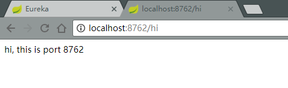
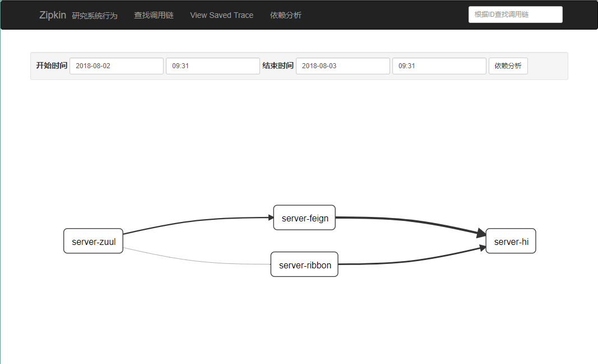

# `Spring Cloud`学习资料与Demo

这个仓库是我学习`Spring Cloud`中的流程、心得与写的demo，分享出来给大家参考。

<!-- TOC -->

- [`Spring Cloud`学习资料与Demo](#spring-cloud学习资料与demo)
    - [Overview](#overview)
    - [个人感受](#个人感受)
    - [服务中心(服务服务端) - `Eureka`实现](#服务中心服务服务端---eureka实现)
        - [创建工程](#创建工程)
        - [功能说明](#功能说明)
    - [服务客户端 - `Eureka`实现](#服务客户端---eureka实现)
        - [创建工程](#创建工程-1)
        - [服务的提供者](#服务的提供者)
        - [服务的消费者 - `Ribbon`+`Rest `](#服务的消费者---ribbonrest-)
        - [服务的消费者 - `Feign`](#服务的消费者---feign)
    - [负载均衡](#负载均衡)
    - [断路器 - `Hystrix`](#断路器---hystrix)
    - [路由网关 - `zuul`](#路由网关---zuul)
        - [什么是`zuul`](#什么是zuul)
        - [创建工程](#创建工程-2)
        - [路由转发](#路由转发)
        - [路由过滤](#路由过滤)
    - [配置管理 - `Spring Cloud Config`](#配置管理---spring-cloud-config)
        - [配置服务器 - `Config Server`](#配置服务器---config-server)
        - [配置客户端 - `Config Client`](#配置客户端---config-client)
        - [消息总线 - `Spring Cloud Bus`](#消息总线---spring-cloud-bus)
    - [服务链路追踪 - `Spring Cloud Sleuth`](#服务链路追踪---spring-cloud-sleuth)
    - [断路器监控 - `Hystrix Dashboard`](#断路器监控---hystrix-dashboard)
    - [断路器聚合监控 - `Hystrix Turbine`](#断路器聚合监控---hystrix-turbine)
    - [高可用的服务中心](#高可用的服务中心)

<!-- /TOC -->

## Overview

> Spring Cloud provides tools for developers to quickly build some of the common patterns in distributed systems (e.g. configuration management, service discovery, circuit breakers, intelligent routing, micro-proxy, control bus, one-time tokens, global locks, leadership election, distributed sessions, cluster state). Coordination of distributed systems leads to boiler plate patterns, and using Spring Cloud developers can quickly stand up services and applications that implement those patterns. They will work well in any distributed environment, including the developer's own laptop, bare metal data centres, and managed platforms such as Cloud Foundry. 

spring cloud 为开发人员提供了快速构建分布式系统的一些工具，包括配置管理、服务发现、断路器、路由、微代理、事件总线、全局锁、决策竞选、分布式会话等等。它运行环境简单，可以在开发人员的电脑上跑。 

## 个人感受

`Spring Cloud`提供了一套完整的微服务体系构架，不同于我们往常写的`Java Web`(例如`SSM`实现的或者是利用`Spring Boot`实现的)本身是一套已经比较完整的业务体系，例如在`Controller`层对`request`进行响应，在`Service`层内调用`Dao`层或者调用其他`API`接口获取数据，`Dao`层实现了对数据库的持久化连接。

而`Spring Cloud`的结构上更倾向于将各个服务模块进行拆分，每个服务单独存在，是一个独立的工程，同时由于`Spring Cloud`基于`Spring Boot`，所以服务构建编译生成成功后都是一个独立的`Jar`包，直接通过`Java`命令就能直接运行在`JVM`上，所以每个服务都能快速部署运行。同时，`Spring Cloud`将先各个服务拆分，然后通过服务注册的方法将所有服务的信息记录在一个**注册服务(服务中心)**上，通过改注册服务，其他服务信息都被其记录，而后被注册的各个服务也能互知，随后也就能互相调用。(自己觉得`Spring Cloud`构架基本功能就是这个)

同时，`Spring Cloud`还为各个服务之间的互相整合、调用、监控等等提供了一系列工具，开发者就能更轻松地进行开发与管理。

`Spring Cloud`实现的微服务体系结构示意：


## 服务中心(服务服务端) - `Eureka`实现

`Eureka`是`Netflix`开源的一款提供服务注册和发现的产品，它提供了完整的Service Registry和Service Discovery实现。也是`Spring Cloud`体系中最重要最核心的组件之一。

`Eureka`将所有的可以提供的服务都注册到它这里来管理，其它各调用者需要的时候来获取，然后再进行调用，避免了服务之间的直接调用，方便后续的水平扩展、故障转移等。 

### 创建工程

以`IDEA`为例，创建`Spring Boot`工程，选择模块`Cloud Discovery - Eureka Server`：


`Maven`依赖为：

```xml
<!-- 继承 -->
<parent>
    <groupId>org.springframework.boot</groupId>
    <artifactId>spring-boot-starter-parent</artifactId>
    <version>2.0.3.RELEASE</version>
    <relativePath/> <!-- lookup parent from repository -->
</parent>
<!-- 版本属性 -->
<properties>
    <project.build.sourceEncoding>UTF-8</project.build.sourceEncoding>
    <project.reporting.outputEncoding>UTF-8</project.reporting.outputEncoding>
    <java.version>1.8</java.version>
    <spring-cloud.version>Finchley.RELEASE</spring-cloud.version>
</properties>
<dependencies>
    <dependency>
        <!-- Eureka服务端模块 -->
        <groupId>org.springframework.cloud</groupId>
        <artifactId>spring-cloud-starter-netflix-eureka-server</artifactId>
    </dependency>
    <dependency>
        <!-- 测试模块 -->
        <groupId>org.springframework.boot</groupId>
        <artifactId>spring-boot-starter-test</artifactId>
        <scope>test</scope>
    </dependency>
</dependencies>
<!-- 通过dependencyManagement进行管理 -->
<dependencyManagement>
    <dependencies>
        <dependency>
            <groupId>org.springframework.cloud</groupId>
            <artifactId>spring-cloud-dependencies</artifactId>
            <version>${spring-cloud.version}</version>
            <type>pom</type>
            <scope>import</scope>
        </dependency>
    </dependencies>
</dependencyManagement>
```

配置项目信息：

```yaml
server: #端口号
  port: 8761

eureka:
  instance:
    hostname: localhost #主机名
  client:
    register-with-eureka: false #无需向服务中心注册自己
    fetch-registry: false #不检索服务
    service-url:
      defaultZone: http://${eureka.instance.hostname}:${server.port}/eureka/ #设定服务注册路径
```

启动类标注：

```java
@EnableEurekaServer  //开启服务中心的标注
@SpringBootApplication
public class EurekaServerApplication {
    public static void main(String[] args) {
        SpringApplication.run(SpringCloudDiscoveryEurekaServerApplication.class, args);
    }
}
```

启动项目，访问http://localhost:8761即可看到服务中心面板：


### 功能说明

在`Spring Cloud`构架中，最为关键的部分就是服务中心，其他所有服务都要向服务中心进行注册，服务中心将会对注册的服务进行治理。其本质上也是一个服务，只不过在但服务中心的系统中，改服务中心不进行注册，但是为了提高服务中心的可用性，实现高可用性的服务注册中心，常常会选择建立多个服务中心，然后服务中心向其他服务中心进行注册。

在`Eureka Server`中，其同步遵循着一个非常简单的原则：只要有一条边将节点连接，就可以进行信息传播与同步。可以采用两两注册的方式实现集群中节点完全对等的效果，实现最高可用性集群，任何一台注册中心故障都不会影响服务的注册与发现 。

## 服务客户端 - `Eureka`实现

在服务中心之外，其余就是服务的客户端，根据服务功能类别等的不同，一般还能将其分为服务的提供者与服务的消费者。

### 创建工程

以`IDEA`为例，创建一个`Spring Boot`工程，选择以下模块：`Web - Web`、`Cloud Discovery - Eureka Discovery`：


其依赖信息为(省略`dependencyManagement`节点、`parent`节点与`properties`节点)：

```xml
<dependencies>
    <dependency>
        <!-- web模块 -->
        <groupId>org.springframework.boot</groupId>
        <artifactId>spring-boot-starter-web</artifactId>
    </dependency>
    <dependency>
        <!-- Eureka客户端模块 -->
        <groupId>org.springframework.cloud</groupId>
        <artifactId>spring-cloud-starter-netflix-eureka-client</artifactId>
    </dependency>
</dependencies>
```

配置项目信息：

```yaml
server: #端口号
  port: 8762

spring:
  application:
    name: server-hi #服务名
eureka:
  client:
    service-url:
      defaultZone: http://localhost:8761/eureka #服务注册地址
  instance:
    lease-expiration-duration-in-seconds: 5  #发呆时间，即服务续约到期时间（缺省为90s）
    lease-renewal-interval-in-seconds: 5     #心跳时间，即服务续约间隔时间（缺省为30s）
```

服务向服务中心注册，服务中心就能获取到服务的信息，在其面板上也就能看到该服务，但是，为了持续地保持两端的交互，即服务中心能知道服务是否在线的状态，所以服务的服务端(服务中心)与服务的客户端会保持一个“心跳”，服务端会定期地检查客户端是否在线，若是在线，该服务将会被服务端续约，然后等待下一次心跳。若是在心跳时间内没有续约成功，那么该服务就会被定义失效，在服务端的配置信息中有`eviction-interval-timer-in-ms`参数用来定义服务端定时清理失效的服务。

服务启动类的注解：

```java
@SpringBootApplication
@EnableEurekaClient //开启Eureka客户端注解
public class Application {
    public static void main(String[] args) {
        SpringApplication.run(SpringCloudDiscoveryEurekaClientApplication.class, args);
    }
}
```

启动应用，然后就能在`Eureka`面板内看到服务信息了。


### 服务的提供者

服务的提供者主要是被其他服务访问获取数据等，所以将当前`Eureka Client工程`添加action响应，修改启动类：

```java
@SpringBootApplication
@EnableEurekaClient
@RestController
public class EurekaClientApplication {
    public static void main(String[] args) {
        SpringApplication.run(EurekaClientApplication.class, args);
    }

    @Value("${server.port}")
    private int port;

    @RequestMapping("/hi")
    public String hi(){
        return "hi, this is port "+port;
    }
}
```

访问http://localhost:8762/hi，访问成功。



### 服务的消费者 - `Ribbon`+`Rest `

服务的消费者是要访问其他服务获取数据，不同于在往常的`web`项目中，访问不同的一个项目中的数据，直接访问`API`接口获取数据，在`Spring Cloud`项目中，所有服务注册在服务中心中，注册在服务中心中的服务互相之间可以通过`Spring Cloud`中的工具进行访问。

新建`Spring Boot`工程，选择以下模块：`Web - Web`、`Cloud Discovery - Eureka Discovery`、`Cloud Routing - Ribbon`：


其依赖为：

```xml
<dependency>
    <!-- web模块 -->
    <groupId>org.springframework.boot</groupId>
    <artifactId>spring-boot-starter-web</artifactId>
</dependency>
<dependency>
    <!-- Eureka客户端模块 -->
    <groupId>org.springframework.cloud</groupId>
    <artifactId>spring-cloud-starter-netflix-eureka-client</artifactId>
</dependency>
<dependency>
    <!-- ribbon模块 -->
    <groupId>org.springframework.cloud</groupId>
    <artifactId>spring-cloud-starter-netflix-ribbon</artifactId>
</dependency>
```

项目配置信息：

```yaml
server: #端口号
  port: 8764

spring:
  application:
    name: server-ribbon #应用名称

eureka:
  client:
    serviceUrl:
      defaultZone: http://localhost:8761/eureka/ #注册地址
```

添加service：

```java
@Service
public class TestService {
    private RestTemplate restTemplate;
    @Autowired
    public TestService(RestTemplate restTemplate) {
        this.restTemplate = restTemplate;
    }
    public String hiService() {
        //通过服务名称在Spring Cloud内访问服务
        return restTemplate.getForObject("http://SERVER-HI/hi",String.class);
    }
}
```

修改启动类：

```java
@SpringBootApplication
@EnableEurekaClient
@EnableDiscoveryClient //开启其他服务发现与访问
public class RibbonRestApplication {
    public static void main(String[] args) {
        SpringApplication.run(RibbonRestApplication.class, args);
    }
    @Bean
    @LoadBalanced
    RestTemplate restTemplate() {
        return new RestTemplate();
    }
    @Autowired
    TestService testService;
    @GetMapping(value = "/hi")
    public String hi() {
        return testService.hiService();
    }
}
```

运行后在面板内可发现该服务，访问http://localhost:8764/hi，显示为访问到端口8672，成功：


### 服务的消费者 - `Feign`

不同于`Ribbon`，`Fegi`本身是一个声明式的伪Http客户端，只需要创建一个接口并注解即可实现。

创建工程，新建`Spring Boot`工程，包含以下模块`Web - Web`、`Cloud Discovery - Eureka Discovery`、`Cloud Routing - Feign`：


其包含以下模块：

```xml
<dependency>
    <!-- web模块 -->
    <groupId>org.springframework.boot</groupId>
    <artifactId>spring-boot-starter-web</artifactId>
</dependency>
<dependency>
    <!-- Eureka客户端模块 -->
    <groupId>org.springframework.cloud</groupId>
    <artifactId>spring-cloud-starter-netflix-eureka-client</artifactId>
</dependency>
<dependency>
    <!-- feign模块 -->
    <groupId>org.springframework.cloud</groupId>
    <artifactId>spring-cloud-starter-openfeign</artifactId>
</dependency>
```

修改配置信息：

```yaml
server:
  port: 8765

spring:
  application:
    name: server-feign

eureka:
  client:
    service-url:
      defaultZone: http://localhost:8761/eureka/
```

修改启动类：

```java
@SpringBootApplication
@EnableEurekaClient
@EnableDiscoveryClient //开启发现服务
@EnableFeignClients    //开启Feign
public class FeignApplication {
    public static void main(String[] args) {
        SpringApplication.run(FeignApplication.class, args);
    }
}
```

新建一个接口，用`Feign`进行注解：

```java
@FeignClient("server-hi")
public interface SchedualServiceHi {
    @GetMapping("/hi")
    String sayHiFromClientOne();
}
```

然后实现控制器：

```java
@RestController
public class TestController {
    @Autowired
    SchedualServiceHi schedualServiceHi;
    @GetMapping("/hi")
    public String sayHi() {
        return schedualServiceHi.sayHiFromClientOne();
    }
}
```

随后，启动服务，访问该服务也能访问到端口8762的内容。

## 负载均衡

由于在`Spring Cloud`中，服务的访问是使用服务名称确定的，所以会存在有相同的服务名的情况，将之前创建的第一个客户端修改端口号为8673，新建运行实例：


然后不断访问Server-Ribbon服务，会发现其每次结果不同，在循环访问两个Server-Hi实例。

这样也基本实现了负载均衡，如果将一个服务同时部署在两台机器上，通过负载均衡的方法，就能将访问平均分散到两台服务器上，提高整体计算能力。

## 断路器 - `Hystrix`

在微服务架构中，根据业务需求拆分成一个个的服务，服务与服务之间相互调用，在`Spring Cloud`可以用`RestTemplate`+`Ribbon`或者`Feign`来实现调用。

但是，与传统框架通过其他的`API`获取数据，但如果由于网络原因不能访问，那么就会抛出异常，或者开发者也能通过回调函数来进行处理，而之前所说的`Ribbon`或者`Feign`其本身是没有这个功能的，同时在`Spring Cloud`构架中，各个服务在服务中心进行注册处理，同时通过心跳来通知服务中心是否其还存在，但是当服务下线，心跳未同步成功，但是在后面一段时间内，服务中心还是保留该服务的，服务也可以尝试访问这些服务，更不要说还有可能访问到错误名称的服务。还有就是如果访问到异常服务，调用这个服务就会出现线程阻塞，此时若有大量的请求涌入，Servlet容器的线程资源会被消耗完毕，导致服务瘫痪。服务与服务之间的依赖性，故障会传播，会对整个微服务系统造成灾难性的严重后果，这就是服务故障的“雪崩”效应。 

为了解决这些问题，业界提出了断路器模型。

> Netflix has created a library called Hystrix that implements the circuit breaker pattern. In a microservice architecture it is common to have multiple layers of service calls. 

`Netflix`开源了`Hystrix`组件，实现了断路器模式，`Spring Cloud`对这一组件进行了整合。 在微服务架构中，一个请求需要调用多个服务是非常常见的，较底层的服务如果出现故障，会导致连锁故障。当对特定的服务的调用的不可用达到一个阀值时，断路器将会被打开。 

断路打开后，可用避免连锁故障，fallback方法可以直接返回一个固定值。 


基于服务Server-Ribbon进行修改，添加`Hystrix`模块：

```xml
<dependency>
    <groupId>org.springframework.cloud</groupId>
    <artifactId>spring-cloud-starter-netflix-hystrix</artifactId>
</dependency>
```

对启动类添加`@EnableHystrix`注解，开启断路器。在访问其他服务的方法上添加`@HystrixCommand`注解在使用断路器：

```java
@Service
public class TestService {
    private RestTemplate restTemplate;
    @Autowired
    public TestService(RestTemplate restTemplate) {
        this.restTemplate = restTemplate;
    }
    @HystrixCommand(fallbackMethod = "hiError") //使用断路器fallback
    public String hiService() {
        return restTemplate.getForObject("http://SERVER-HI/hi",String.class);
    }
    public String hiError() {  //fallback返回值
        return "hi, sorry, it's error!";
    }
}
```

关闭Server-Hi服务，访问Server-Ribbon：


## 路由网关 - `zuul`

在Spring Cloud微服务系统中，一种常见的负载均衡方式是，客户端的请求首先经过负载均衡（`zuul`、`Ngnix`），再到达服务网关（`zuul`集群），然后再到具体的服服务。服务统一注册到高可用的服务注册中心集群，服务的所有的配置文件由配置服务管理，配置服务的配置文件放在git仓库，方便开发人员随时改配置。 

### 什么是`zuul`

`zuul`的主要功能是路由转发和过滤器。路由功能是微服务的一部分(感觉有些像重定向)，比如`/api/user`转发到到`user`服务，`/api/shop`转发到到`shop`服务。`zuul`默认和`ribbon`结合实现了负载均衡的功能。 

### 创建工程

新建`spring boot`工程，选择以下模块，`Web - Web`、`Cloud Discovery - Eureka Discovery`、`Cloud Routing - Zull`：


其包含以下依赖：

```xml
<dependency>
    <!-- web模块 -->
    <groupId>org.springframework.boot</groupId>
    <artifactId>spring-boot-starter-web</artifactId>
</dependency>
<dependency>
    <!-- Eureka客户端模块 -->
    <groupId>org.springframework.cloud</groupId>
    <artifactId>spring-cloud-starter-netflix-eureka-client</artifactId>
</dependency>
<dependency>
    <!-- zuul模块 -->
    <groupId>org.springframework.cloud</groupId>
    <artifactId>spring-cloud-starter-netflix-zuul</artifactId>
</dependency>
```

在启动类上注解开启`zuul`：

```java
@SpringBootApplication
@EnableZuulProxy  //开启zuul
@EnableEurekaClient
@EnableDiscoveryClient
public class ZuulApplication {
    public static void main(String[] args) {
        SpringApplication.run(ZuulApplication.class, args);
    }
}
```

基本配置：

```yaml
server:
  port: 8770

spring:
  application:
    name: server-zuul
  zipkin:
      base-url: http://localhost:9411

eureka:
  client:
    serviceUrl:
      defaultZone: http://localhost:8761/eureka/
```

### 路由转发

在`application.yml`中配置`zuul`的转发：

```yaml
zuul: #zuul配置
  routes: #转发
    api-a: #转发"api-a"到server-ribbon服务
      path: /api-a/**
      serviceId: server-ribbon
    api-b: #转发"api-b"到server-feign服务
      path: /api-b/**
      serviceId: server-feign
```

启动服务，访问http://localhost:8770/api-a/hi成功。

### 路由过滤

在使用`zuul`进行转发中，使用其还能作为过滤器来过滤某些不和要求的request，也可以进行安全验证，自定义一个类，继承过滤器类`ZuulFilter `:

```java
@Component
public class MyFilter extends ZuulFilter {
    @Override
    public String filterType() {
        return "pre";  //过滤器类型，前置
        /*pre:请求执行之前filter
          route: 处理请求，进行路由
          post: 请求处理完成后执行的filter
          error:出现错误时执行的filter
         */
    }
    @Override
    public int filterOrder() {
        return 0;  //优先级，数字越大越低
    }
    @Override
    public boolean shouldFilter() {
        return true;  //是否要过滤，是
    }
    @Override
    public Object run() {
        RequestContext requestContext = RequestContext.getCurrentContext();
        HttpServletRequest request=requestContext.getRequest();  //获取到request
        String accessToken = request.getParameter("token");
        if(!accessToken.equals("123")) {
            requestContext.setSendZuulResponse(false);  //过滤，不对其进行路由
        }
        return null;
    }
}
```

每到过滤器过滤，会抛出异常`ZuulException`，实现过滤效果。


## 配置管理 - `Spring Cloud Config`

在分布式系统中，服务数量可能十分巨大，为了方便服务配置文件统一管理，实时更新，所以需要分布式配置中心组件。在`Spring Cloud`中，可以使用`Spring Cloud Config`，它又分两个角色，一是`config server`，二是`config client`，可以实现将配置文件分开存储进行管理。

### 配置服务器 - `Config Server`

使用`Config Server`可以实现让当前服务读取到本地或者存储在`Git`、`Svn`服务器上的配置文件。新建`Spring boot`工程，选择以下模块，`Web - Web`、`Cloud Discovery - Eureka Discovery`、`Cloud Config - Config Server`：


包含以下依赖：

```xml
<dependency>
    <!-- web模块 -->
    <groupId>org.springframework.boot</groupId>
    <artifactId>spring-boot-starter-web</artifactId>
</dependency>
<dependency>
    <!-- 配置服务器模块 -->
    <groupId>org.springframework.cloud</groupId>
    <artifactId>spring-cloud-config-server</artifactId>
</dependency>
<dependency>
    <!-- Eureka客户端模块 -->
    <groupId>org.springframework.cloud</groupId>
    <artifactId>spring-cloud-starter-netflix-eureka-client</artifactId>
</dependency>
```

在启动类上加上以下注解：

```java
@SpringBootApplication
@EnableConfigServer  //开启配置服务器
@EnableEurekaClient
```

进行项目配置：

```yaml
server:
  port: 8888

spring:
  application:
    name: config-server
  cloud:
    config:
      server: #配置配件文件存放地址
       git:   #使用git服务器
         uri: https://gitee.com/yananart/SpringCloudConfig #服务器地址
         search-paths: / #扫描地址
       default-label: master #master分支

eureka:
  client:
    service-url: #服务注册地址
      defaultZone: http://localhost:8761/eureka/
```

对配置文件的格式与命名也有以下要求：

- /{application}/{profile}[/{label}]
- /{application}-{profile}.yml
- /{label}/{application}-{profile}.yml
- /{application}-{profile}.properties
- /{label}/{application}-{profile}.properties

例如，我新建了一个`yananart-dev.yml`的配置文件上传到服务器，其中yananart即application，dev即profile，内容为：

```yaml
name: yananart
age: 23
version: dev
```

启动服务，访问http://localhost:8888/yananart/dev可查看到：

```json
{
    "name": "yananart",
    "profiles": [
        "dev"
    ],
    "label": null,
    "version": "47df8f03911cd226ff663fee9ee481ac05bd5432",
    "state": null,
    "propertySources": [
        {
            "name": "https://gitee.com/yananart/SpringCloudConfig/yananart-dev.yml",
            "source": {
                "name": "yananart",
                "age": 23,
                "version": "dev"
            }
        }
    ]
}
```

由于对于`Config Server`来说，每次查询配置信息是实时的，所以当修改配置文件后，访问服务得到的也是修改后的数据。

### 配置客户端 - `Config Client`

 类似的，创建一个新的`Spring Boot`应用，将`Config Server`模块改为`Config Client`模块：


依赖为：

```xml
<dependency>
    <groupId>org.springframework.boot</groupId>
    <artifactId>spring-boot-starter-web</artifactId>
</dependency>
<dependency>
    <!-- 配置客户端模块 -->
    <groupId>org.springframework.cloud</groupId>
    <artifactId>spring-cloud-starter-config</artifactId>
</dependency>
<dependency>
    <groupId>org.springframework.cloud</groupId>
    <artifactId>spring-cloud-starter-netflix-eureka-client</artifactId>
</dependency>
```

配置项目信息：

```yaml
server:
  port: 8889

spring:
  application:
    name: config-client
  cloud:
    config:
      name: yananart #配置应用名
      uri: http://localhost:8888/ #配置服务器地址
      label: master #主分支
      profile: dev #dev类型

eureka:
  client:
    service-url: #服务注册地址
      defaultZone: http://localhost:8761/eureka/
```

在代码中使用注入：

```java
@SpringBootApplication
@EnableEurekaClient
@EnableDiscoveryClient
@RestController
public class ConfigClientApplication {
    public static void main(String[] args) {
        SpringApplication.run(ConfigClientApplication.class, args);
    }
    @Value("${name}") //注入name
    private String result;
    @Value("${age}") //注入age
    private int age;
    @Value("${version}") //注入version
    private String version="hhh";
    @RequestMapping(value = "/hi") //响应"/hi"
    public String hi(){
        return "hi, "+result+", age:"+age+", env: "+version;
    }
}
```

启动服务器，访问http://localhost:8889/hi可以访问到数据，但是通过日志信息，我们可以发现，该项目是在启动时访问了配置服务器，获取到了相应配置信息注入到了属性中，这些值都被存储在了`spring`环境中，项目启动后应该就不再发送变化，每次修改配置信息后就都要重启该服务，为了解决该问题就要使用到消息总线。

### 消息总线 - `Spring Cloud Bus`

> Spring Cloud Bus links nodes of a distributed system with a lightweight message broker. This can then be used to broadcast state changes (e.g. configuration changes) or other management instructions. The only implementation currently is with an AMQP broker as the transport, but the same basic feature set (and some more depending on the transport) is on the roadmap for other transports. 

需要实现消息总线，一般需要使用到`rabbitMq`服务：

> As long as Spring Cloud Bus AMQP and RabbitMQ are on the classpath any Spring Boot application will try to contact a RabbitMQ server on `localhost:5672` (the default value of`spring.rabbitmq.addresses`): 

在本地计算机需要自行安装`rabbitMq`，可以到[这里下载](http://www.rabbitmq.com/download.html)，安装后启动服务，在控制台输入以下命令：

```powershell
rabbitmq-plugins enable rabbitmq_management
```

加载可视化插件，访问http://localhost:15672，可进入管理界面，初始化账号密码均为guest，进入控台，在Admin菜单下可新建账户，在Queues菜单下可查看现在使用的消息队列。

返回工程`Config-Client`添加`Spring Cloud Bus`依赖：

```xml
<dependency>
    <!-- 消息总线模块 -->
    <groupId>org.springframework.cloud</groupId>
    <artifactId>spring-cloud-starter-bus-amqp</artifactId>
</dependency>
<dependency>
    <!-- 监控模块 -->
    <groupId>org.springframework.boot</groupId>
    <artifactId>spring-boot-starter-actuator</artifactId>
</dependency>
```

在配置中添加：

```yaml
spring:
  cloud:
    bus: #开启spring cloud bus
      enabled: true
      trace:
        enabled: true
  rabbitmq: #rabbitmq相关配置
    host: localhost
    port: 5672
    username: guest
    password: guest

#重点：在spring boot 2.0版本中一定要修改此配置，可以选择【"health","mappings","bus-refresh"】三种选项暴露那些端点
management:
  endpoints:
    web:
      exposure:
        include: bus-refresh
```

在启动类上添加`@RefreshScope `注解，启动项目，可以发现在日志信息中打印出：

```shell
Mapped "{[/actuator/bus-refresh],methods=[POST]}" onto public java.lang.Object org.springframework.boot.actuate.endpoint.web.servlet.AbstractWebMvcEndpointHandlerMapping$OperationHandler.handle(javax.servlet.http.HttpServletRequest,java.util.Map<java.lang.String, java.lang.String>)
```

先访问一次配置客户端，然后修改配置源文件，再次访问配置客户端，发现还是原来的数据，使用Postman模拟post访问http://localhost:8889//actuator/bus-refresh，可以在日志信息内看到`Config-Client`再次读取了`Config-Server`的数据，访问，可以发现数据已经更新。

在`RabbitMQ`管理界面内也能看到该服务：


## 服务链路追踪 - `Spring Cloud Sleuth`

> Spring Cloud Sleuth implements a distributed tracing solution for Spring Cloud, borrowing heavily from [Dapper](http://research.google.com/pubs/pub36356.html), [Zipkin](https://github.com/openzipkin/zipkin) and HTrace. For most users Sleuth should be invisible, and all your interactions with external systems should be instrumented automatically. You can capture data simply in logs, or by sending it to a remote collector service. 

微服务架构上将业务划分为服务，通过REST调用，对外暴露的一个接口，很多时候一个接口可能需要很多个服务协同才能完成，如果链路上任何一个服务出现问题，都会形成导致接口调用失败。而随着业务的不断扩张，服务之间互相调用会越来越复杂。 服务链路追踪主要功能就是在分布式系统中提供追踪解决方案，兼容支持`zipkin`，你在pom文件中引入相应的依赖即可使用。

在`Spring Boot`老版本(1.0)中，`zipkin`需要自行引入构建，在2.0中`Spring Cloud`已经移除该支持，需要下载Jar包直接运行即可，[下载地址](https://dl.bintray.com/openzipkin/maven/io/zipkin/java/zipkin-server/)。下载成功后直接在本地控制台运行即可：

```powershell
java -jar zipkin-server-*.jar
```

访问http://localhost:9494即可查看到监控界面。

改造之前的服务，目前可改造`Server-Hi `、`Server-Ribbon`、`Server-Fegin`、`Server-Zuul`，给它们添加依赖：

```xml
<dependency>
    <groupId>org.springframework.cloud</groupId>
    <artifactId>spring-cloud-starter-zipkin</artifactId>
</dependency>
```

添加配置信息：

```yaml
spring:
  zipkin:
    base-url: http://localhost:9411 #zipkin地址
```

重启几个服务，然后多次访问几个服务，稍后就能在`zipkin`界面的依赖分析内看到服务间的调用等，在其他几个功能中还能看到详细信息：




## 断路器监控 - `Hystrix Dashboard`

`Hystrix Dashboard`，它主要用来实时监控`Hystrix`的各项指标信息。通过`Hystrix Dashboard`反馈的实时信息，可以帮助我们快速发现系统中存在的问题。 

可以新建一个项目进行监控，这里直接在`Server-Ribbon`的项目上进行修改，添加依赖：

```xml
<dependency>
    <!-- 断路器监控模块 -->
    <groupId>org.springframework.cloud</groupId>
    <artifactId>spring-cloud-starter-netflix-hystrix-dashboard</artifactId>
</dependency>
```

在启动类上添加注解`@EnableHystrixDashboard`以启动断路器监控。

重启服务，访问http://ideapad720s:8764/hystrix即可看到监控面板，在日志信息内也能看到要监控的地址：

```powershell
Proxy opening connection to: http://ideapad720s:8764/hystrix.stream
```


添加监控地址进行监控，访问改服务，使用压力测试工具访问，得到结果：


具体说明：


## 断路器聚合监控 - `Hystrix Turbine`

看单个的`Hystrix Dashboard`的数据并没有什么多大的价值，尤其当服务数量十分巨大的时候，这时候就需要监视整个系统，此时用到`Hystrix Turbine`。`Hystrix Turbine`将每个服务`Hystrix Dashboard`数据进行了整合。`Hystrix Turbine`的使用非常简单，只需要引入相应的依赖和加上注解和配置就可以了。

新建`Spring Boot`项目，选择以下模块：

 

依赖信息：

```xml
<dependency>
    <!-- 监控模块 -->
    <groupId>org.springframework.boot</groupId>
    <artifactId>spring-boot-starter-actuator</artifactId>
</dependency>
<dependency>
    <!-- web模块 -->
    <groupId>org.springframework.boot</groupId>
    <artifactId>spring-boot-starter-web</artifactId>
</dependency>
<dependency>
    <!-- eureka客户端模块 -->
    <groupId>org.springframework.cloud</groupId>
    <artifactId>spring-cloud-starter-netflix-eureka-client</artifactId>
</dependency>
<dependency>
    <!-- 断路器模块 -->
    <groupId>org.springframework.cloud</groupId>
    <artifactId>spring-cloud-starter-netflix-hystrix</artifactId>
</dependency>
<dependency>
    <!-- 断路器监控模块 -->
    <groupId>org.springframework.cloud</groupId>
    <artifactId>spring-cloud-starter-netflix-hystrix-dashboard</artifactId>
</dependency>
<dependency>
    <!-- 断路器聚合监控模块 -->
    <groupId>org.springframework.cloud</groupId>
    <artifactId>spring-cloud-starter-netflix-turbine</artifactId>
</dependency>
```

配置文件为：

```yaml
server:
  port: 8666

spring:
  application:
    name: server-turbine

eureka:
  client:
    serviceUrl:
      defaultZone: http://localhost:8761/eureka/

turbine:
  app-config: SERVER-RIBBON #表明监控哪些服务
  aggregator:
    cluster-config: default # 指定聚合哪些集群，多个使用","分割，默认为default。
  cluster-name-expression: new String("default")
```

在启动项上加上以下注解：

```java
@SpringBootApplication
@EnableEurekaClient
@EnableDiscoveryClient
@RestController
@EnableHystrix
@EnableHystrixDashboard
@EnableTurbine
```

但是这边有一个版本兼容性问题，在`Spring Cloud`2.0版本之后。在`turbine`项目内不能在配置自定监控的各个服务的断路器监控的子路径。`turbine`默认选用的是`/actuator/hystrix.stream`(这是1.0版本下的默认路径)，但是当前版本下，断路器监控监听的路径却是默认为`/hystrix.stream`，为解决这个问题，有两种解决方案。

- 将`turbine`版本降级，降到1.0版本就能自定义监听的路径。或者将`hystrix`版本降级，这样默认监听路径就恢复为`/actuator/hystrix.stream`。
- 在不改版本的情况下(保持所有组件版本统一)，在需要监控的子服务内定义重定向，将`/actuator/hystrix.stream`重定向到`/hystrix.stream`。

这样处理后就能正常进行监听，启动服务，访问http://localhost:8666/hystrix，监听http://localhost:8666/turbine.stream。访问几次`Server-Ribbon`，监控信息出现。

## 高可用的服务中心

在前面的讨论中，对于`Spring Cloud`这个微服务构架，我们考虑到了服务与服务间的关系，考虑到大型系统中可能存在服务异常调用失败的情况，尤其是当服务数量极其巨大之时，但是，服务中心也是一个服务，所有服务都将在服务中心上注册，一个服务出现异常我们可以通过断路器来解决异常，但其也会影响业务的一部分，但是，服务中心同作为一个服务，其如果出现异常则会导致整个系统瘫痪。

为了解决这种问题，提出了高可用的服务中心概念。

修改原先的服务中心。修改配置文件：

```yaml
spring:
  application:
    name: eureka-server
  profiles:
    active: peer1

eureka:
  client:
    register-with-eureka: false #无需向服务中心注册自己
    fetch-registry: false #不检索服务
```

其他信息删除，然后新建几个配置文件：

```yaml
#----------/application-peer1.yml/----------
server:
  port: 8761
eureka:
  instance:
    hostname: peer1
  client:
    service-url:
      defaultZone: http://peer2:8762/eureka/,http://peer3:8763/eureka/

#----------/application-peer2.yml/----------
server:
  port: 8762
eureka:
  instance:
    hostname: peer2
  client:
    service-url:
      defaultZone: http://peer1:8761/eureka/,http://peer3:8763/eureka/

#----------/application-peer3.yml/----------
server:
  port: 8763
eureka:
  instance:
    hostname: peer3
  client:
    service-url:
      defaultZone: http://peer1:8761/eureka/,http://peer2:8762/eureka/
```

然后先关闭其他所有服务，每次修改`application.yml`中的`spring.profiles.active`属性值，分别启动三个实例。

注意这里用例自定义域名peer，需要修改host文件，这是为模拟在不同服务器上的服务中心。

服务中心启动后，查看peer1的管理页面也能看到其他两个服务中心：


然后修改其他服务，将它们的注册地址`defaultZone`都修改为`http://peer1:8761/eureka/,http://peer2:8762/eureka/,http://peer3:8763/eureka/`，即同时向三个服务中心注册。注册成功后，在三个管理页面都能看到其服务信息。访问服务均正常。

此时，关闭其中任意一个服务中心，都不会影响其他服务运行，只有所有注册的服务中心均异常才会使系统崩溃，这样一来，系统因为服务中心异常而崩溃的可能性就大大降低，实现了高可用的服务中心。